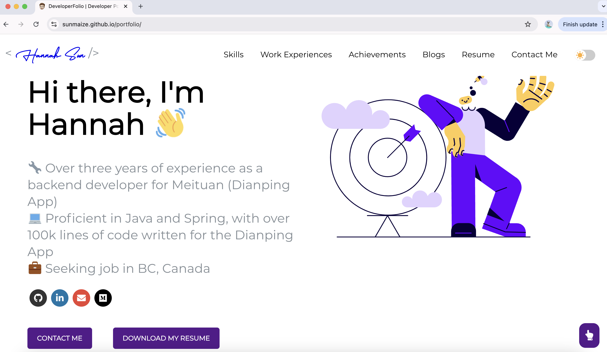

# Building and Deploying a Personal Portfolio Website with GitHub Pages

As a developer, having a personal portfolio website is essential for showcasing your skills and projects. This guide walks you through the process of setting up a portfolio website using the [DeveloperFolio](https://github.com/saadpasta/developerFolio) project and deploying it via GitHub Pages.

## Steps

### 1. Fork the GitHub Repository
Start by forking the [DeveloperFolio](https://github.com/saadpasta/developerFolio) repository. You can do this directly on GitHub. Afterward, clone the forked repository to your local environment:

```bash
git clone git@github.com:your-username/developerFolio.git
```

### 2. Verify Installation of Git, Node, and npm
Ensure that you have Git, Node.js, and npm installed on your system. You can verify the versions with the following commands:

```bash
git --version
node --version
npm --version
```

Make sure your Node.js version is above `10.16`, and npm version is above `5.6`.

### 3. Configure Environment Variables
Copy the `env.example` file in the root directory and rename it to `.env`. Then, fill in your details, such as your GitHub and Medium profiles:

```bash
cp env.example .env
```

The `.env` file is used to store configuration details specific to your environment, such as social media links and GitHub tokens.

### 4. Customize `src/portfolio.js`
This is the core configuration file of the project. The file is modular, allowing you to easily modify various sections based on your preferences.

- **Enable or Disable Modules**: You can control which sections of the portfolio are displayed by setting `display` to `true` or `false`. For example, to hide the GitHub profile section:

    ```js
    showGithubProfile: {
      display: false // Set to false to hide
    }
    ```

- **Customize Skills Icons**: The project uses [Font Awesome](https://fontawesome.com/) for skill icons, but not all my skills had corresponding icons available. To address this, I modified the `SoftwareSkill.js` and relevant CSS files to handle both Font Awesome classes and custom `iconUrl`s. Here’s what I did:
    - **Added support for `iconUrl`**: This allows loading custom icons via external URLs.
    - **Standardized icon size and hover effects**: I ensured all icons had uniform sizing and added color change effects on hover for a polished look.

### 5. Replace the Favicon
To personalize the website further, I used [RealFaviconGenerator](https://realfavicongenerator.net/) to upload my logo and generate a full set of favicons for different devices. Replace the default favicon files in the `public` folder with the generated ones from the tool.

### 6. Run Code Format Check
Before deploying, it's important to maintain consistent code formatting. The project uses Prettier for this purpose. You can run the following commands to check and format your code:

```bash
npm run check-format
npm run format
```

- `npm run check-format` checks for any formatting issues, and if there are files you don't want Prettier to process, you can add them to the `.prettierignore` file.
- `npm run format` automatically fixes any format issues in the code.

### 7. Prepare for Deployment
I chose to use GitHub Actions to automatically deploy my portfolio website. Before deploying, make sure you set the `homepage` and `name` fields in your `package.json` file to point to your GitHub Pages URL:

```json
"homepage": "https://your-username.github.io/your-portfolio",
"name": "your-portfolio"
```

### 8. Clean and Build the Project
Before deployment, it's important to clean up the project and prepare it for production. Run the following commands:

```bash
npx gh-pages-clean
npx gh-pages -d build
```

These commands will clean up the build cache and push the static files from the `build` directory to the `gh-pages` branch. GitHub Actions will then trigger the workflow to deploy the site to your GitHub Pages domain.

## References
Throughout this process, I used the following resources:
- [DeveloperFolio Source Code](https://github.com/saadpasta/developerFolio)
- [GitHub Pages Deployment for React Projects](https://create-react-app.dev/docs/deployment/#github-pages)
- [Icons8](https://icons8.com/) for sourcing custom icons.
- [RealFaviconGenerator](https://realfavicongenerator.net/) to generate favicon files.

By following these steps, you can easily deploy your own portfolio website and access it at the URL you specified in the `package.json`. Enjoy showcasing your projects and skills in style!
